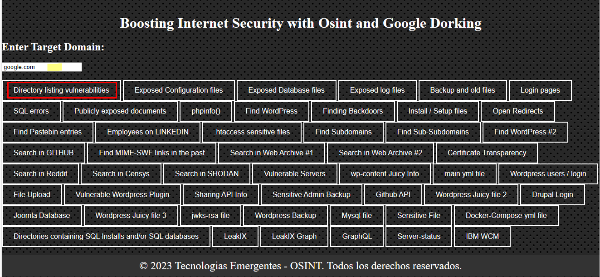
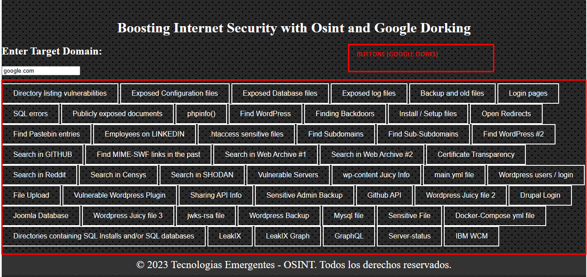
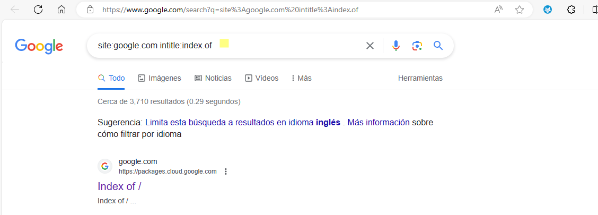

# BISOGD
Boosting Internet Security with Osint and Google Dorking
It can be used to find sensitive information from a company (domain) through OSINT and Google Dorking 

# Installation on Linux
   * `git clone https://github.com/jesusgavancho/BISOGD.git`
   * `cd BISOGD`
   * `firefox BISOGD.html`
# Installation on Windows
  * `git clone https://github.com/jesusgavancho/BISOGD.git` or Download as a Zip then open BISOGD.html with Google Chrome or Microsoft Edge, Brave or Firefox.  

# Usage Example
`Enter a domain: google.com`

`Then press the buttons (google dorks) in order to find sensitive information. Remember do it ethically. `

# Disclaimer
BISOGD is intended for educational purposes only. The creator assumes no responsibility for any illegal activities carried out with it, and the code is made public for viewing purposes only. Please use this tool ethically and responsibly.
